# Marble Blast Powered Up Web
A Web port of Marble Blast Powered Up. The marble physics code was taken from MBWeb along with my own collision detection code, game logic was partially from scratch and taken with permission from [Marble Blast Web Port](https://github.com/Vanilagy/MarbleBlast).

Play it here:  

## Features
This Game is a Mod of the Original Game Marble Blast Gold. It includes almost 4000 community levels, including 150 original MBPU levels (25 Beginner, 30 Intermediate, 70 Advanced and 25 Sandbox ) and more than 3900 community custom levels. It implements all gameplay elements, sounds, music and UI/menu components from Marble Blast Powered Up - additional features include a replay system and online leaderboards. The game can be played using a keyboard, mouse, gamepad or on your mobile device.

## Screenshots
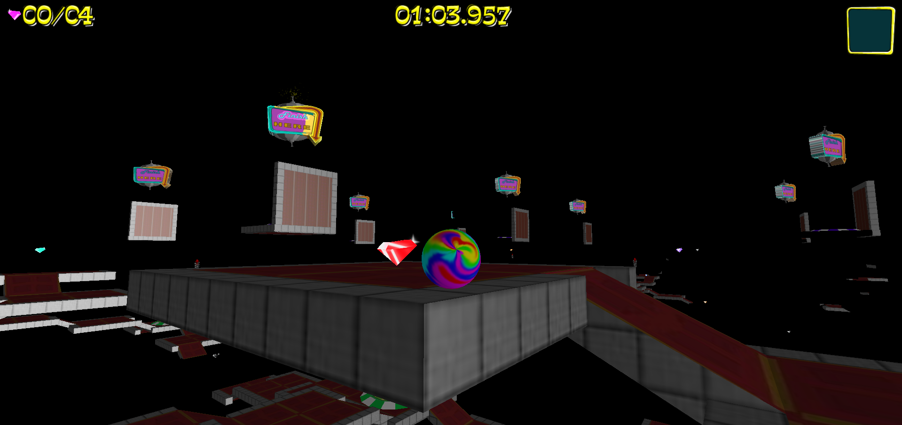
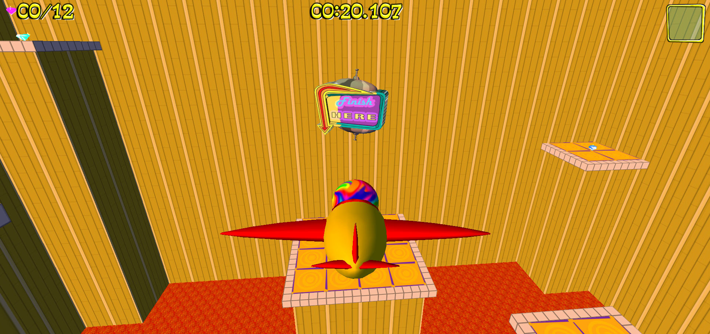
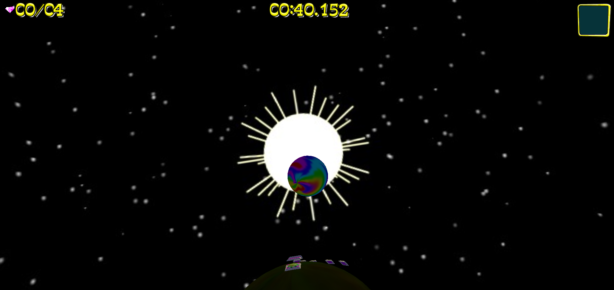
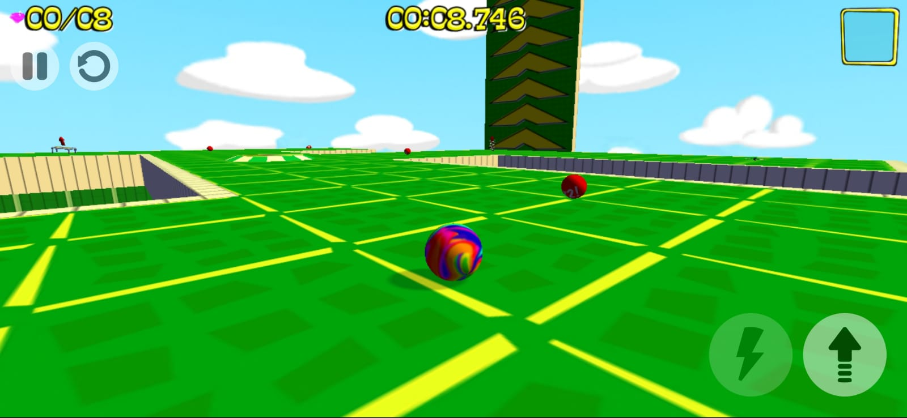
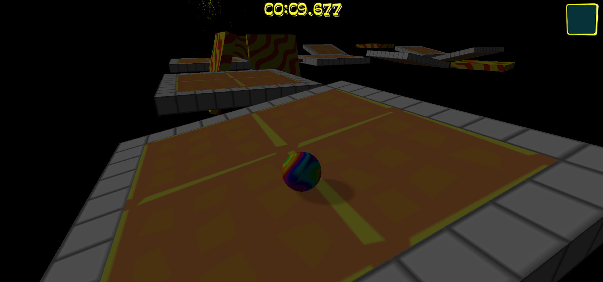
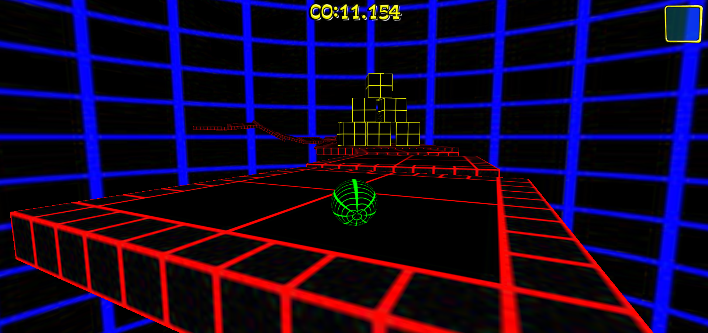
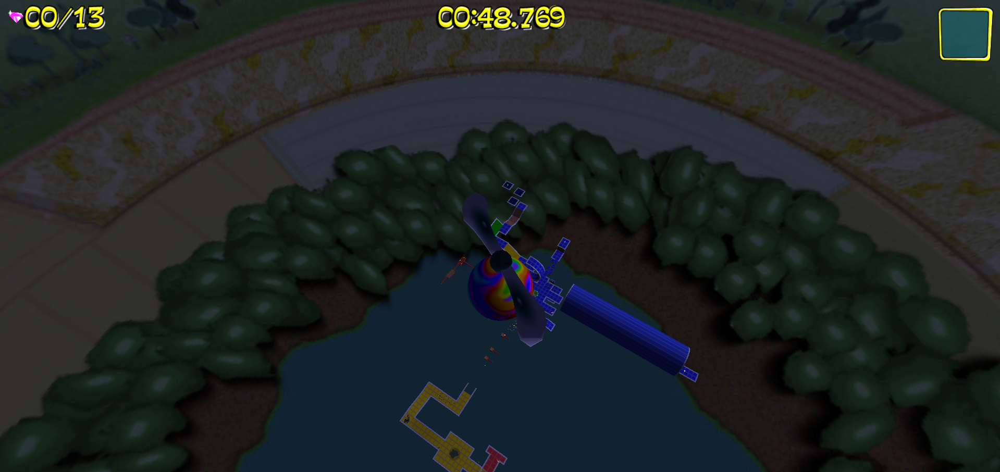
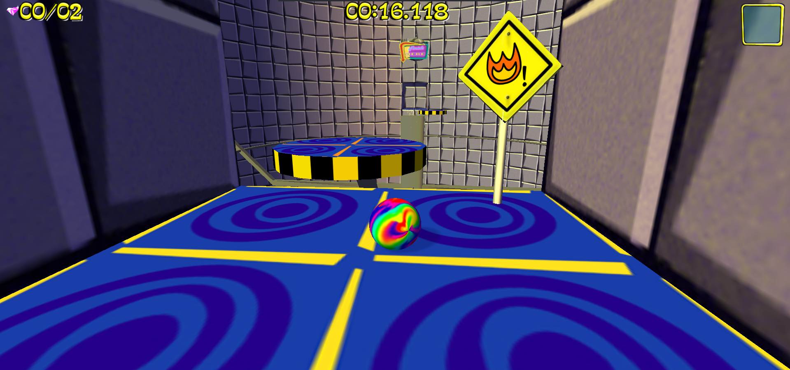
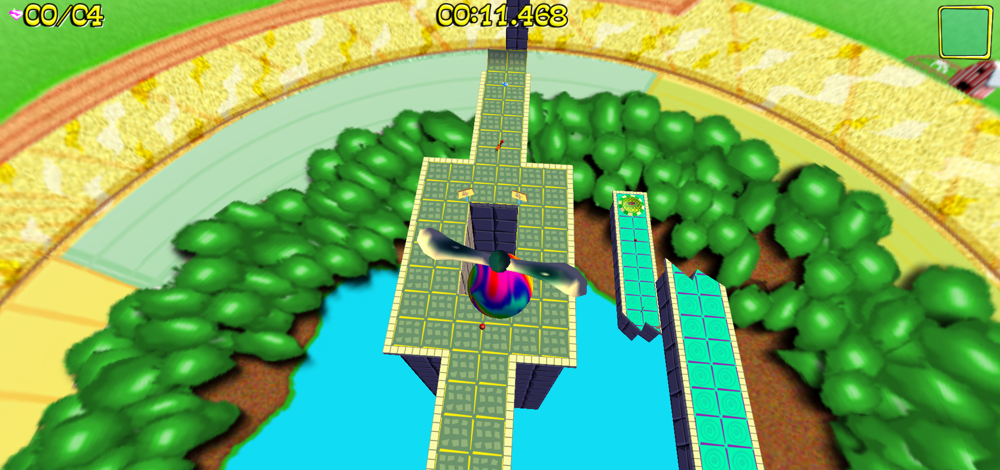
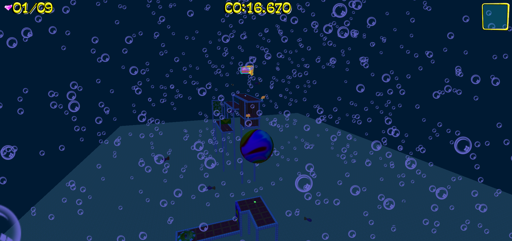
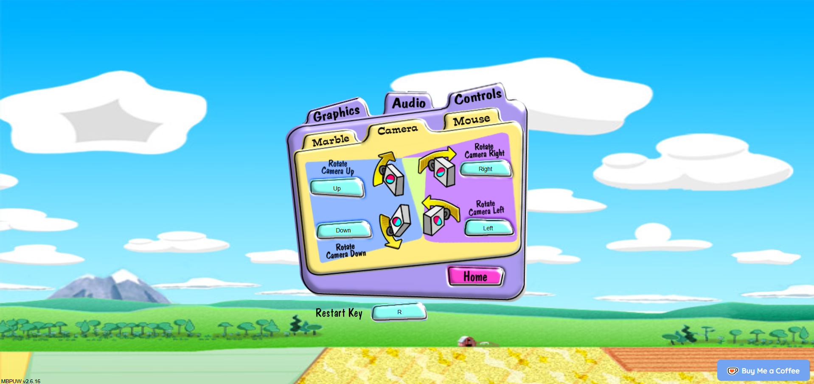

## Building and developing
You can build the game yourself. For this, simply clone the repository, then run `npm install --legacy-peer-deps` and `npm run compile`, which will compile the TypeScript code using [rollup](https://rollupjs.org/guide/en/). Then run `npm start` to start up the server (runs on :8080 by default). For fast development run `npm run watch-fast` (or `npm run watch` for a slower, but typechecked version). If you wish to bundle the project, run `npm run bundle`, which uses [Sarcina](https://github.com/Vanilagy/Sarcina) and writes to `dist/`.

**Note:** This project has a dependency that requires `node-gyp`. Install `node-gyp` _before_ running `npm install` on this project with `npm install -g node-gyp`, and if you're on Windows, make sure to run `npm install --global --production windows-build-tools` right afterwards in an _elevated command prompt_.

## Notes
The current version only runs on the newest versions of Chromium-based browsers, Firefox and Safari, both on desktop and on mobile. Android support should be top-notch, and Safari is as best as it can be given Apple's restrictive PWA features on iOS. Additional thanks to the maintainers of [pako](https://github.com/nodeca/pako) and [jszip](https://github.com/Stuk/jszip) for making other parts of this project possible, as well as to [Vanilagy](https://github.com/Vanilagy), [RandomityGuy](https://github.com/RandomityGuy) for helping me out with parts of the code, and to the entire Marble Blast community for their feedback and support. I highly recommend you check out GarageGames's original version of Marble Blast Powered Up, as well as the game's community, here: https://marbleblast.com/
